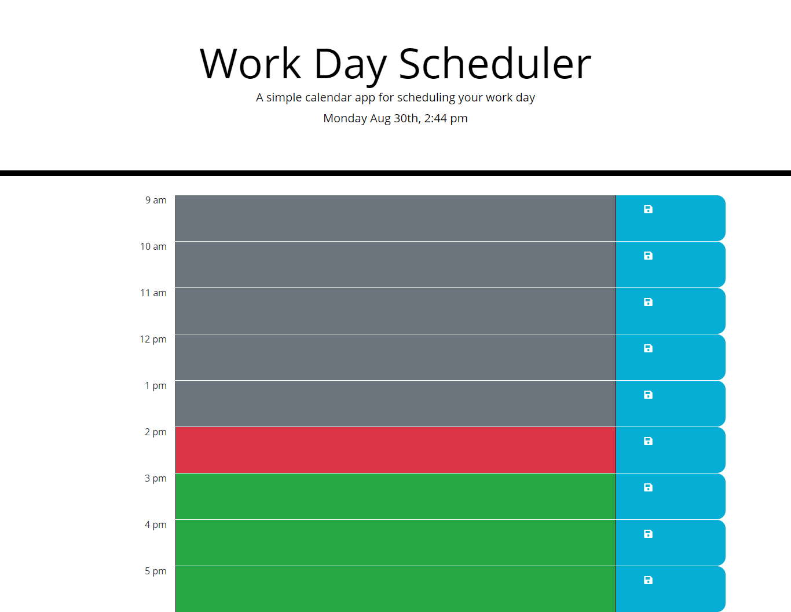

# Work Day Scheduler Starter Code

* URL to this repository https://github.com/LifeInvaderr/Daily-Task-Scheduler.
* URL to the deployed Repository https://lifeinvaderr.github.io/Daily-Task-Scheduler/

## Description
Work day scheduler allows users to create a task list for the upcomming day. Set with one hour increments starting from 9:00am to 5:00pm.

## Table of Contents
* [Technologies](#technologies)
* [Installation](#installation)
* [Usage](#usage)
* [Questions](#questions)

## Technologies
* Javascript
* JQuery
* HTML5
* CSS
* Moment.js

## Installation
To install this repository, please either clone or install the zip version.

## Usage
With Work Day Scheduler, it allows users to make and track their daily goals. With daily task scheduler, time blocks are marked for passed, current, and future.

## Questions
For any questions or concerns, please email me at matthewkausfox@gmail.com

Thank you!
